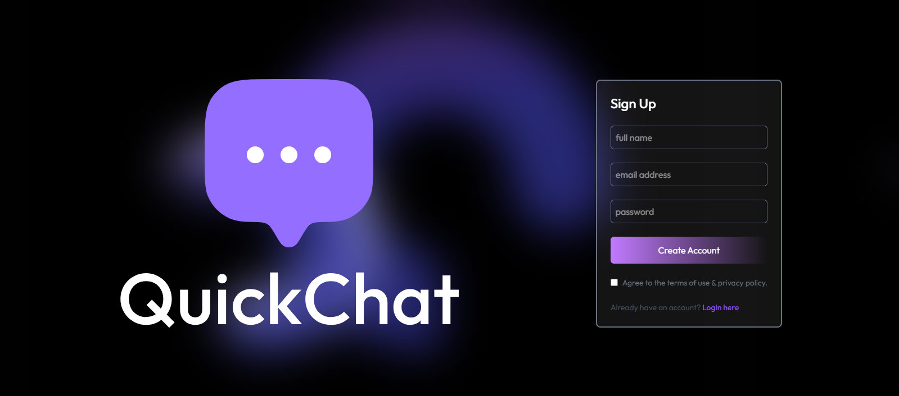

# Chat Application

A real-time chat application built with React, Node.js, Express, and Socket.io.

 <!-- Add a screenshot if available -->

## Features

- 🔐 User authentication (Login/Register)
- 💬 Real-time messaging with Socket.io
- 👥 User list with online status indicators
- 📸 Image sharing in chats
- 📱 Responsive design for mobile and desktop
- 🔔 Unread message notifications
- 🖼️ Media gallery in conversations

## Technologies Used

### Frontend
- React.js
- React Context API (State management)
- Socket.io-client (Real-time communication)
- Tailwind CSS (Styling)
- Axios (HTTP requests)
- React Icons
- React Hot Toast (Notifications)

### Backend
- Node.js
- Express.js
- MongoDB (Database)
- Mongoose (ODM)
- Socket.io (Real-time communication)
- JWT (Authentication)
- Bcrypt (Password hashing)
